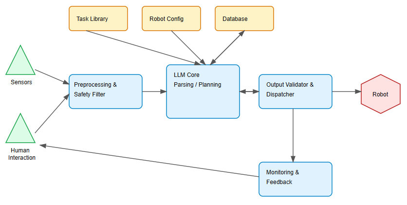

# 🤖 Human-Robot Communication Architecture

A layered architecture for efficient human-robot communication in industrial environments, combining AI-powered natural language processing with vision-based robotics.

## 🎯 Project Overview

This project develops an AI-based framework that translates human instructions into safe, structured robotic actions for industrial applications.

## 🏗️ System Architecture

### Key Components:
- **🧠 LLM Core**: Natural language understanding and task planning
- **👁️ Vision Model**: YOLO-based object detection for precise positioning  
- **🛡️ Safety Validation**: Multi-layer safety checks and command validation
- **📊 Monitoring System**: Real-time feedback and performance tracking

## 🏭 Industrial Applications

- **📦 Material Handling** - Automated sorting and packaging
- **🔗 Welding & Soldering** - Precision automotive assembly  
- **🎨 Automated Painting** - Quality surface coating
- **⚙️ High-Precision Assembly** - Component manufacturing
- **🏪 Warehousing Automation** - Inventory management

## 🔬 Current Use Case

**Color-Based Sorting System**
- Uses vision model to detect and classify objects by color
- Guides robotic arm for accurate item placement
- Demonstrates real-time human-robot collaboration

## 🛠️ Implementation Stack

- **Python** - Core development
- **React** - Operator interface
- **Google Gemini API** - LLM processing
- **YOLO** - Computer vision
- **ROS** - Robot control
- **NoSQL** - Data storage

## 🚀 Getting Started

1. Clone the repository
2. Install dependencies: `pip install -r requirements.txt`
3. Configure robot parameters in config files
4. Launch the system: `python main.py`
5. Access the web interface for operations

## 👥 Team

**Interns:**
- Zergaoui Mohamed Elamine Ali
- Mouhoub Iyed

**Supervisor:**
- AKLI Isma

---

*Building safer, more intuitive human-robot collaboration for the future of industrial automation* 🌟
